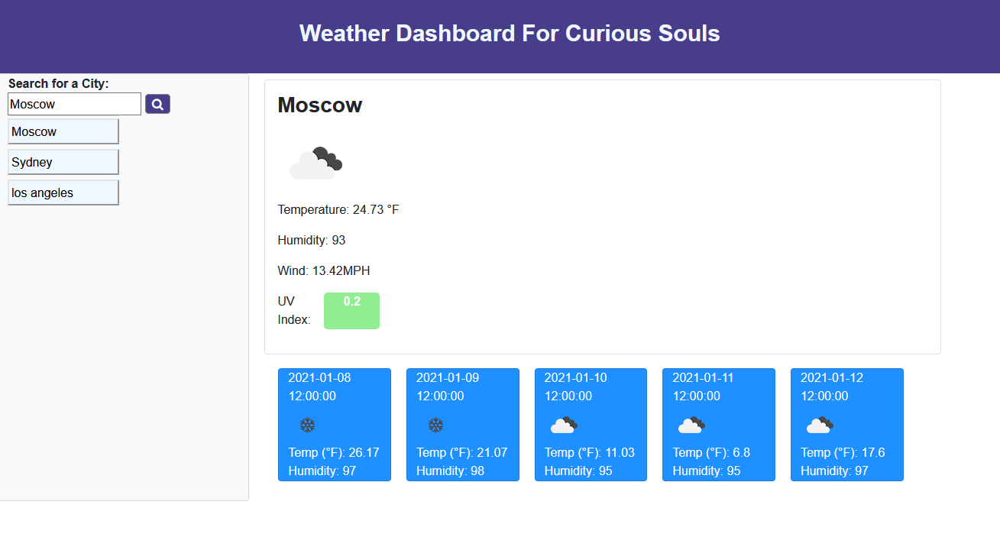

# Weather Dashboard

## Description
Hello! This deployed webpage displays basic current and forecasted weather information for the city of the user's choice. Using the OpenWeather API, the application uses the user's entry into the search box to populate the page with helpful weather information including temperature, humidity, and the UV index. The UV index is colored green, orange, or red to respectively signify mild, moderate, or severe conditions. Each city entry also creates a button underneath the search box that the user can click to re-load that city's weather data.


## Table of Contents
* [Technologies Used](#technologies-used)
* [How to Access](#how-to-access)
* [What I Did](#what-i-did)
* [Code Snippets](#code-snippets)
* [Screenshots](#screenshots)
* [Acknowledgments](#acknowledgments*)
* [Who I Am](#who-i-am)

---

## Technologies Used
* [HTML](https://www.w3schools.com/html/) to structure the "skeleton" of the webpage and its elements.
* [CSS](https://www.w3schools.com/css/) for visual styling to make that HTML much prettier.
* [Javascript](https://www.javascript.com/) to develop the algorithms included in this web application.
* [jQuery](https://api.jquery.com/) for shorthand Javascript commands included in the code.
* [Bootstrap](https://getbootstrap.com/) for shorthand CSS styling within the HTML.
* [Git](https://git-scm.com/) for distributed version control, tracking changes over time and making them visible to collaborators.
* [Github](https://github.com/) for version control in the cloud, saving my changes and presenting them clearly to myself and others.

## How to Access
* [Click here](https://prophetrand.github.io/weather-api-dashboard/) to view the deployed Weather Dashboard.

---

## What I Did
I used HTML to create the initial structure of the page, and included unique ID tags on its divisions to be targeted by the Javascript. I used a CSS stylesheet along with Bootstrap classes to define visual stylings for the page. Finally, I used Javascript and jQuery to populate the contents of the page by interacting with the free OpenWeather API using AJAX requests.

## Code Snippets 
In the code snippet below, UVI data is accessed through the OpenWeather API and placed into the appropriate HTML division using jQuery commands.

First, latitude (lat) and longitude (lon) are pulled from the JSON object from a previous AJAX request (not shown), which corresponds to the city entered by the user. The lon and lat are placed into a URL string within the variable queryUV, which then serves as the API call in the AJAX request shown. The variable uvColor serves as a placeholder for the HTML division with the id "#uv-field", whose text is set to the UV index value from the newly-retrieved JSON object.

In the if/else tree, the color of the division is modified to reflect mild/moderate/severe thresholds in order to quickly display to the user the potential risk to health due to the sun's UV rays at the given location.

```
lat = response.coord.lat;
lon = response.coord.lon;

var queryUV = "https://api.openweathermap.org/data/2.5/onecall?lat=" + lat + "&lon=" + lon + "&appid=fc68e264d139e3d3a853b82e6c6117e9&units=imperial";

    $.ajax({
        url: queryUV,
        method: "GET"
    }).then(function(response){
        var uvi = response.current.uvi;
        var uvColor = $("#uv-field");
        uvColor.text(uvi);

        if (uvi < 3.0){
            uvColor.addClass("mild")
        } else if (uvi >= 3.0 && uvi < 6.0){
            uvColor.addClass("moderate")
        } else if (uvi >= 6.0){
            uvColor.addClass("severe")
        }
    });
```

## Screenshots




---

## Acknowledgments
* [W3Schools](https://www.w3schools.com/) has been my go-to for descriptive tutorials on HTML, CSS, and Javascript syntax and best practices. I am eternally grateful for their massive store of documentation.
* [MDN Web Docs](https://developer.mozilla.org/en-US/) is another resource for documentation on HTML, CSS, and Javascript that I find myself using more and more often as I work through deeper Javascript.
* [OpenWeather](https://openweathermap.org/) is a free API that allows parsing of real-time weather data from locations across the globe, including forecast data.
* UC Berkeley Coding Bootcamp provided the initial HTML to begin developing from.


## Who I Am
My name is Rand Hale, and I am an aspiring programmer/web developer based in California.

* [LinkedIn](https://www.linkedin.com/in/rand-hale-83ba389b/)
* [Portfolio](https://prophetrand.github.io/my-responsive-portfolio/)